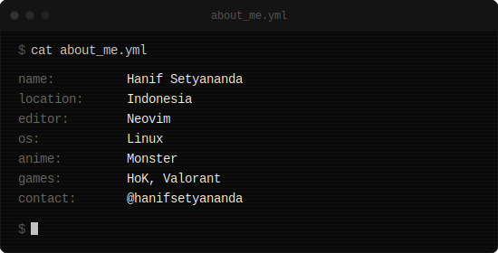
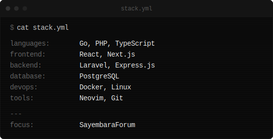
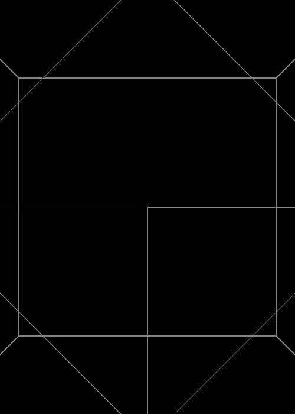

<div align="center">
  
</div>

<br/>

<!-- ROW 1: hand.gif | about me -->

<table border="0" width="100%">
<tr>
<td width="25%" align="center" valign="middle">

</td>
<td width="75%" valign="middle">

</td>
</tr>
</table>

<br/>

<!-- ROW 2: tech stack | hold.gif -->

<table border="0" width="100%">
<tr>
<td width="75%" valign="middle">

</td>
<td width="25%" align="center" valign="middle">

</td>
</tr>
</table>

---

<div align="center">

#### idk bout these stats, they look cool so i slapped em onto my homepage

<small>Last updated: kept alive for GitHub presence.</small>

<div align="center">


</div>
<!-- 
<a href="https://github.com/hanifsetyananda">
  
</a>
<a href="https://github.com/hanifsetyananda">
  
</a> -->


</div>


<!--START_SECTION:waka-->

```txt
Markdown      1 hr 5 mins           ██████████████▓░░░░░░░░░░   58.08 %
Image (svg)   23 mins               █████▒░░░░░░░░░░░░░░░░░░░   21.14 %
Text          18 mins               ████░░░░░░░░░░░░░░░░░░░░░   16.05 %
YAML          5 mins                █▒░░░░░░░░░░░░░░░░░░░░░░░   04.73 %
```

<!--END_SECTION:waka-->
<div align="center">


</div>